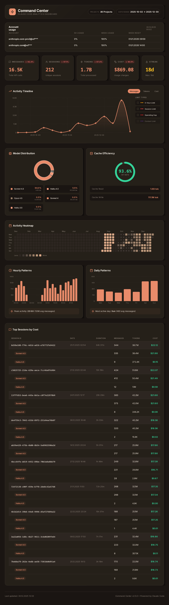

Command Center - panel CC

---

## Claude Code Usage Reports

Modern SQLite-based analytics for Claude Code usage with intelligent caching.

**Inspiration:** The idea and analysis approach were inspired by [cc-wrapped](https://github.com/numman-ali/cc-wrapped).

### Example Report



**Features:**
- 📅 Activity heatmap with daily usage patterns
- 📊 Top models by token consumption
- 💾 Cache efficiency metrics (read/write/hit rate)
- 📈 Total sessions, messages, and tokens
- 🔥 Current usage streak tracking

### Installation

**Option 1: Global installation (recommended)**

```bash
uv tool install -e .
```

After this, you can run `command-center` from anywhere without activation.

**Option 2: Local virtual environment**

```bash
uv sync
source .venv/bin/activate
```

### Usage

**After global installation (`uv tool install -e .`):**

```bash
# Generate report for current year
command-center --verbose

# Generate report for specific date range
command-center --from 2024-01-01 --to 2024-12-31

# Generate report with compact date format
command-center --from 20250101 --to 20250131

# Show database statistics
command-center --db-stats
```

**With local venv (`uv sync`):**

```bash
# Activate venv first
source .venv/bin/activate

# Then run
command-center --verbose
```

**Without installation:**

```bash
uv run command-center --verbose
```

### CLI Options

- `--from DATE` - Start date in YYYY-MM-DD or YYYYMMDD format (default: January 1 of current year)
- `--to DATE` - End date in YYYY-MM-DD or YYYYMMDD format (default: today)
- `--verbose` - Show detailed progress and statistics
- `--force-rescan` - Ignore file tracking, rescan all files
- `--rebuild-db` - Delete and rebuild database from scratch
- `--db-stats` - Show database statistics and exit
- `--update-pricing` - Update pricing cache from LiteLLM and exit
- `--list-projects` - List all discovered projects with metadata
- `--update-project` - Update project: PROJECT_ID "name" "description"

### How It Works

**First Run**: Imports ALL historical data from all years (~1-2 minutes)
**Subsequent Runs**: Only processes new/modified files (<5 seconds)

Data stored in `~/.claude/db/command_center.db` with hourly aggregation (local time).

### Output

- PNG Image: `cc-usage-report-{date_from}_{date_to}.png`
- Terminal display (Kitty/iTerm2/WezTerm/Ghostty/Konsole/VS Code)

### Requirements

- Python >= 3.10
- Pillow >= 10.0.0
- rich >= 13.0.0

### Technical Documentation

Complete technical documentation is available in separate chapters:

#### Core Concepts
- [1. Executive Summary](docs/chapters/01-executive-summary.md)
- [2. System Overview](docs/chapters/02-system-overview.md)
- [3. Architecture & Design Philosophy](docs/chapters/03-architecture-design-philosophy.md)

#### Implementation Details
- [4. Data Pipeline Architecture](docs/chapters/04-data-pipeline-architecture.md)
- [5. Database Schema & Design](docs/chapters/05-database-schema-design.md)
- [6. Time Handling & UTC Conversion](docs/chapters/06-time-handling-utc-conversion.md)
- [7. Incremental Update Mechanism](docs/chapters/07-incremental-update-mechanism.md)
- [8. Deduplication Strategy](docs/chapters/08-deduplication-strategy.md)

#### Advanced Features
- [9. Aggregation Layer](docs/chapters/09-aggregation-layer.md)
- [10. Visualization System](docs/chapters/10-visualization-system.md)
- [11. API Reference](docs/chapters/11-api-reference.md)

#### Operations & Maintenance
- [12. Performance Characteristics](docs/chapters/12-performance-characteristics.md)
- [13. Security & Data Privacy](docs/chapters/13-security-data-privacy.md)
- [14. Deployment & Configuration](docs/chapters/14-deployment-configuration.md)
- [15. Troubleshooting Guide](docs/chapters/15-troubleshooting-guide.md)

#### Reference
- [16. Appendices](docs/chapters/16-appendices.md)
- [17. Conclusion](docs/chapters/17-conclusion.md)

📖 **[Browse all chapters](docs/chapters/README.md)**
